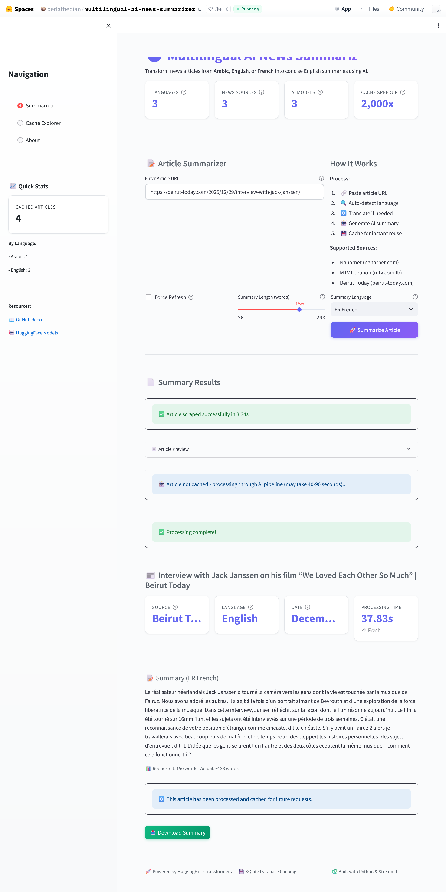
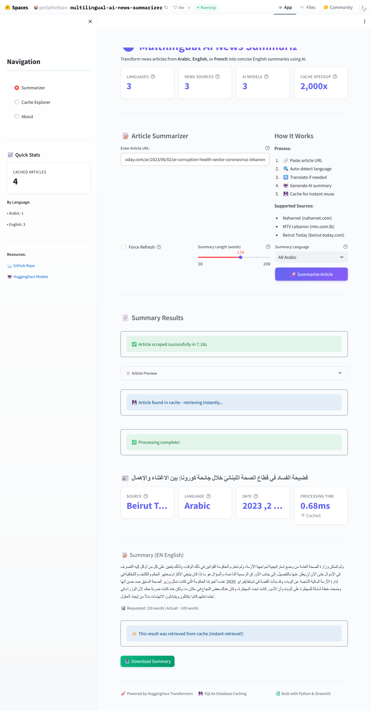
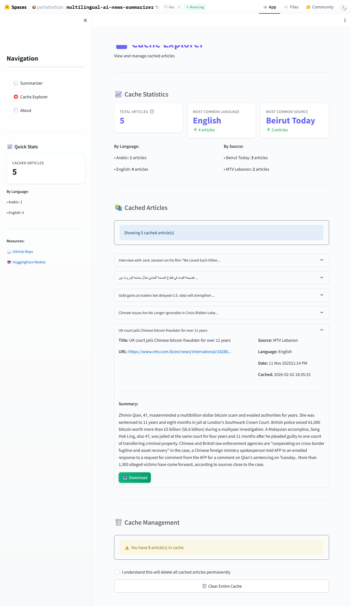
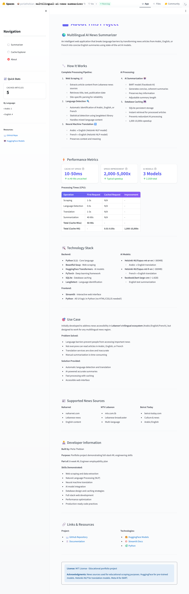

# 🌍 Multilingual AI News Summarizer

[](https://huggingface.co/spaces/perlathebian/multilingual-ai-news-summarizer)
[](https://github.com/perlathebian/multilingual-ai-news-summarizer)
[](https://www.python.org/)
[](https://huggingface.co/spaces/perlathebian/multilingual-ai-news-summarizer)

> **[Try the Live App →](https://huggingface.co/spaces/perlathebian/multilingual-ai-news-summarizer)**

Transform news articles from Arabic, English, or French into concise summaries in any of these languages using state-of-the-art AI.

---

**Demo Video:** [Watch Demo](https://1drv.ms/v/c/fe2fb007f7f25e16/IQBRA35ggJ5jQ7mnYNIaQoFcAYfj_3eKem99hGi3fyMz64w?e=q2Vmzh)

## Problem & Solution

**Problem:** In multilingual regions, news sources publish in different languages, creating accessibility barriers.

**Solution:** An intelligent system that scrapes news, detects language, translates if needed, generates AI-powered summaries, and delivers them in the user's preferred language.

---

## Quick Demo Output

<details>
<summary>Click to see example processing output</summary>

<br>

**Processing an English Article (First Time - Cache Miss):**

```
URL: https://www.mtv.com.lb/en/news/International/1628197/gold-gains...

Step 1: Scraping article... (7.47s)
    Successfully extracted from MTV Lebanon
   Title: Gold gains as traders bet delayed U.S. data will strengthen...
   Text length: 1,823 characters

Step 2: Language Detection
    Detected language: English (en)

Step 3: Summarization
    Loading BART model (first time only)... 8.8s
    Generating summary...
    Summary generated (276 characters)

SUMMARY:
Spot gold was up 0.1% at $4,118.58 per ounce. Gold tends to benefit
in low-interest rate environments. Markets see a 64% chance of a
rate cut in December.

Processing time: 23.50s
 Cached for future requests
```

**Same Article Again (Cache Hit):**

```
Processing time: 0.02s (1,175x faster!)
 Retrieved from cache
```

**Processing an Arabic Article with French Output:**

```
URL: https://beirut-today.com/ar/2022/10/19/...

Step 1: Scraping article... (5.11s)
    Title: الغاز بأفضل السيناريوهات ليس كافيًا...

Step 2: Language Detection
    Detected language: Arabic (ar)

Step 3: Translation (Arabic → English)
    Loading Helsinki-NLP model... 3.6s
    Translation complete

Step 4: Summarization
    Summary generated

Step 5: Translation (English → French)
    Loading reverse translation model...
    Final summary in French delivered

Processing time: 86.41s
 Cached for future requests
```

</details>

---

## Features

### Live Web Application

**[Try it now!](https://huggingface.co/spaces/perlathebian/multilingual-ai-news-summarizer)** - Deployed on HuggingFace Spaces

- Beautiful Streamlit interface with custom styling
- Multi-page navigation (Summarizer, Cache Explorer, About)
- Real-time processing indicators and error handling
- Download summaries as text files
- Desktop-optimized (mobile not supported)

### AI/ML Pipeline

- **Language Detection:** Automatic identification (Arabic/English/French)
- **Neural Translation:** Bidirectional between all 3 languages (Helsinki-NLP models)
- **AI Summarization:** Facebook BART-large-CNN model
- **Adjustable Length:** 30-200 words with accurate word counting
- **Smart Processing:** Lazy model loading, chunking for long text

### Multi-Source Scraping

- **Naharnet** (naharnet.com) - Lebanese news
- **MTV Lebanon** (mtv.com.lb) - Lebanese broadcaster
- **Beirut Today** (beirut-today.com) - Culture & news
- DRY architecture with shared helper functions
- Automatic source detection and site-specific parsing

### Performance Optimization

- **SQLite Caching:** Persistent storage with CRUD operations
- **Smart Cache Checking:** Instant retrieval for processed articles
- **Massive Speedup:** 1,000-10,000x faster for cached requests
- **Shared Cache:** All users benefit from each other's requests

### DevOps & Deployment

- Deployed on HuggingFace Spaces (16GB RAM, CPU)
- GitHub Actions CI/CD pipeline (auto-deploy on push)
- Separate branches for development and deployment
- Docker-ready architecture

---

## Architecture

```
Naharnet / MTV Lebanon / Beirut Today
              │
              ▼
    Web Scraper (BeautifulSoup)
    [scraper.py — site-specific parsers]
              │
              ▼
    Language Detection (LangDetect)
              │
              ├─[cache hit]──→ SQLite Cache → Return Summary (0.01s)
              │
              ▼
    [ar/fr only] Helsinki-NLP Translation → English
              │
              ▼
    BART Summarization (facebook/bart-large-cnn)
    [pipeline.py]
              │
              ▼
    [optional] Translate Summary to Output Language
              │
              ▼
    SQLite Cache Write + Return to User
    [db.py — CRUD operations]
```

**Pipeline files:**

- `scraper.py`: site-specific parsers with shared helper functions
- `pipeline.py`: language detection, translation, summarization, caching logic
- `db.py`: SQLite CRUD layer with cache hit/miss logic
- `app.py`: Streamlit interface calling the pipeline

---

## Tech Stack

**Backend:** Python 3.11, Beautiful Soup, Requests, SQLite  
**AI/ML:** HuggingFace Transformers, PyTorch, LangDetect, SentencePiece  
**Frontend:** Streamlit with custom CSS  
**Deployment:** HuggingFace Spaces, GitHub Actions  
**Models:** Helsinki-NLP (translation), Facebook BART (summarization)

---

## Screenshots

### Main Summarizer Interface




### Cache Explorer Dashboard



### About & Documentation



---

## Database Schema

### Articles Table

| Column              | Type                | Description                               |
| ------------------- | ------------------- | ----------------------------------------- |
| `id`                | INTEGER PRIMARY KEY | Auto-increment ID                         |
| `url`               | TEXT UNIQUE         | Article URL (prevents duplicates)         |
| `source`            | TEXT                | News source name                          |
| `title`             | TEXT                | Article title                             |
| `original_language` | TEXT                | Detected language (ar/en/fr)              |
| `original_text`     | TEXT                | Full article text                         |
| `english_text`      | TEXT                | Translated text (NULL if already English) |
| `summary`           | TEXT                | AI-generated summary                      |
| `date_published`    | TEXT                | Article publication date                  |
| `date_processed`    | TIMESTAMP           | When article was cached                   |
| `processing_time`   | TEXT                | Processing duration                       |

**Key Feature:** `url` UNIQUE constraint prevents duplicate processing and enables O(1) cache lookups.

---

## Performance Metrics

| Metric             | Cache Miss | Cache Hit  | Improvement      |
| ------------------ | ---------- | ---------- | ---------------- |
| **Total Time**     | 50-90s     | 0.01-0.05s | **2,000-5,000x** |
| Language Detection | <1s        | N/A        | -                |
| Translation        | 1-3s       | N/A        | -                |
| Summarization      | 40-80s     | N/A        | -                |
| Database Retrieval | N/A        | 10-50ms    | -                |

**Model Sizes:**

- Arabic Translation: ~300MB
- French Translation: ~300MB
- Summarization: ~1.6GB
- **Total:** ~2.2GB (downloaded once, cached forever)

---

## Logging & Error Handling

All pipeline activity is logged with timestamps to `logs/pipeline.log`:

- URL received and scraping start
- Language detected (ar/en/fr)
- Cache hit or miss
- Translation triggered (language pair + model load time)
- Summarization start and completion (input length, output word count)
- Processing errors with full context

**User-facing error handling in the Streamlit UI:**

- Network/timeout errors: clear retry message
- HTTP 403/404: specific troubleshooting guidance
- Unsupported news source: lists supported domains
- Failed scrape: tips for verifying URL and article availability
- Technical details available in collapsible debug expander

---

## Installation

```bash
# Clone repository
git clone https://github.com/perlathebian/multilingual-ai-news-summarizer.git
cd multilingual-ai-news-summarizer

# Create virtual environment
python -m venv venv
source venv/bin/activate  # Windows: venv\Scripts\activate

# Install dependencies
pip install -r requirements.txt

# Run web app
streamlit run app.py

# Or try CLI demo
python demo.py
```

**First Run:** Downloads ~2GB of AI models (10-15 minutes, one-time only)

---

## Project Structure

```
multilingual-ai-news-summarizer/
├── app.py              # Streamlit web interface (multi-page)
├── pipeline.py         # AI pipeline with caching
├── scraper.py          # Multi-source web scraping
├── db.py               # SQLite database layer (CRUD)
├── demo.py             # CLI demo script
├── cache_demo.py       # Cache performance demo
├── requirements.txt    # Python dependencies
├── articles.db         # SQLite database (auto-generated)
└── README.md
```

---

## Development Roadmap

**Completed Features:**

- [x] Project structure and setup
- [x] Site compatibility testing
- [x] Multi-source web scraping (3 Lebanese sources)
- [x] Language detection (Arabic/English/French)
- [x] Neural machine translation (bidirectional)
- [x] AI-powered summarization (BART)
- [x] Multi-language summary output
- [x] SQLite caching layer with CRUD operations
- [x] Cache performance optimization
- [x] Interactive Streamlit web interface
- [x] Multi-page navigation
- [x] Cache explorer with statistics
- [x] About page with documentation
- [x] Custom styling and UX polish
- [x] Deployment to HuggingFace Spaces
- [x] GitHub Actions CI/CD pipeline
- [x] Live public demo

**Future Enhancements:**

- [ ] Mobile-responsive interface
- [ ] Additional news sources
- [ ] More languages (Spanish, German, etc.)
- [ ] User authentication and personal caches
- [ ] API endpoint for programmatic access

---

## Usage Examples

### Basic Pipeline

```python
from scraper import get_article
from pipeline import process_article_with_cache

# Scrape and process
article = get_article("https://www.naharnet.com/stories/en/12345")
result = process_article_with_cache(article,
                                     summary_max_length=150,
                                     output_language='fr')

print(result['summary'])  # French summary
```

### Language Detection

```python
from pipeline import detect_language

detect_language("مرحبا")  # Returns 'ar'
detect_language("Hello")  # Returns 'en'
```

### Cache Management

```python
import db

# Get statistics
stats = db.get_cache_stats()
print(f"Total cached: {stats['total_articles']}")

# Get all cached articles
articles = db.get_all_articles()

# Clear cache
db.clear_cache()
```

---

## Limitations

- **News Sources:** Only supports 3 Lebanese news sources
- **Platform:** Desktop-optimized interface only (mobile not supported)
- **Languages:** Limited to Arabic, English, French
- **Performance:** First-time processing takes 30-90 seconds
- **Translation:** Quality varies by content type and language pair

---

## Use Case

**Primary Applications:**

1. **Cross-Language Accessibility:** Developed for Lebanon's trilingual news ecosystem (Arabic/English/French) where important information is scattered across language-specific sources. Breaks down language barriers to ensure everyone can access critical news regardless of which language it was published in.

2. **Time-Efficient News Consumption:** Condenses lengthy articles into concise summaries (30-200 words), enabling busy professionals, students, and readers to stay informed without reading full articles. What takes 10 minutes to read is reduced to 30 seconds.

**Applicable to:** Any multilingual region, international organizations, news aggregation platforms, or anyone needing quick access to information across language barriers.

---

## Author

Perla Thebian - [GitHub](https://github.com/perlathebian)

---

**Built with:** Python • HuggingFace • Streamlit • SQLite • GitHub Actions
